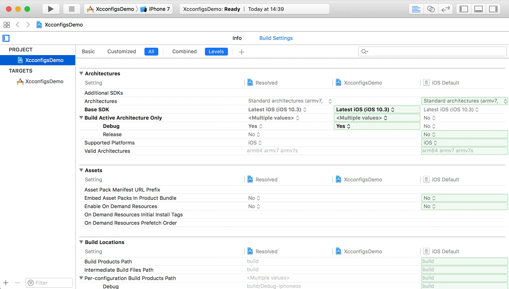
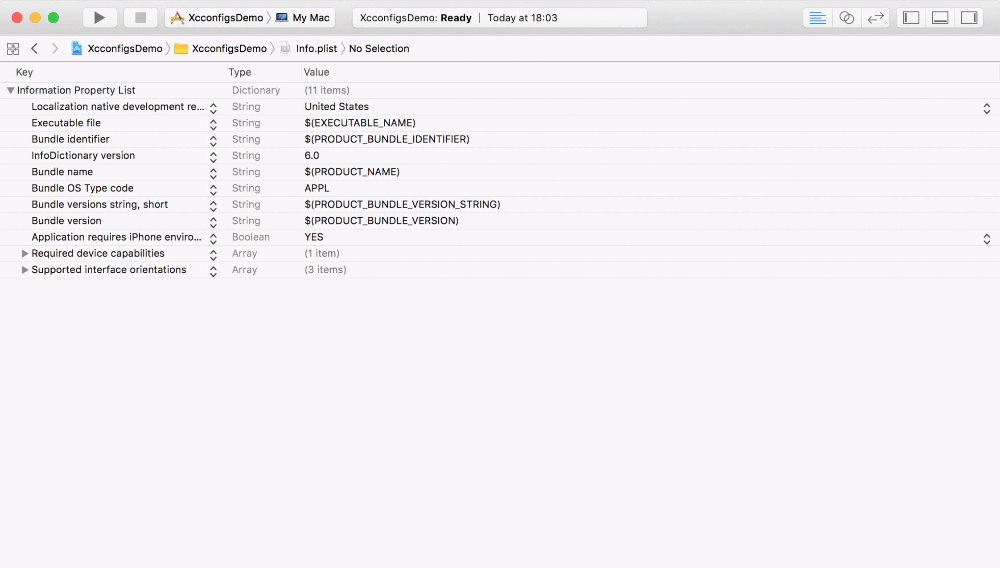
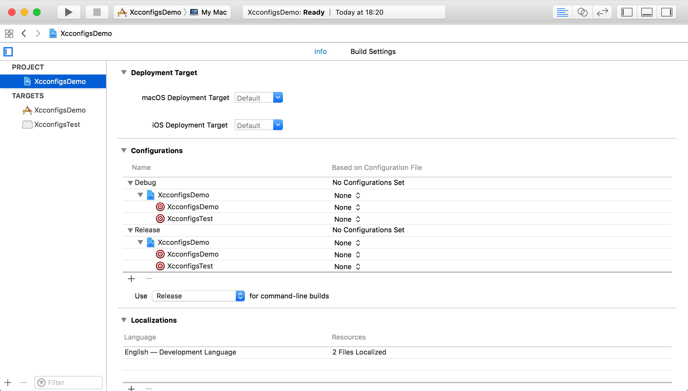
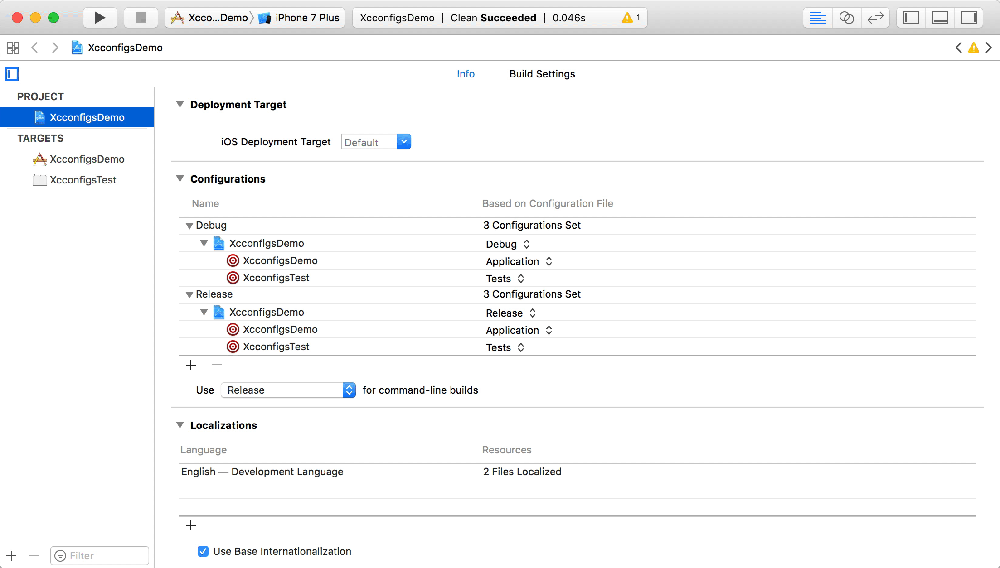

# xcconfigs – Usage

This document describes usage of `xcconfigs`.

---

### 0. Install netguru/xcconfigs

Start by installing `xcconfigs`. In this example we'll use Carthage.

Add the following dependency to your `Cartfile`:

```none
github "netguru/xcconfigs" {version}
```

Then, while in the root directory of your project, update the dependencies by running:

```sh
$ carthage update xcconfigs
```

This will add `xcconfigs` to `Carthage/Checkouts/xcconfigs` directory.

### 1. Remove build settings from xcodeproj file

Open your project and remove default build settings created by Xcode.

To do this, select the project in Navigator panel, go to Build Settings, select all by pressing `⌘A` and then nuke everything by pressing `⌫`. Repeat this step for all targets.



### 2. Create your custom xcconfigs

In order to use `xcconfigs`, you need to create your own xcconfig files and `#include` these `xcconfigs` in appropriate places.

In this example, we'll create configuration files for a sample iOS app and its test bundle and we'll use the following structure:

| File          | Purpose                                                     | Includes                                                       |
|:--------------|:------------------------------------------------------------|:---------------------------------------------------------------|
| `Base`        | Contains base build settings used by all targets.           | `xcconfigs/Common/Common`                                      |
| `Debug`       | Contains base build settings used in Debug configuration    | `Base`<br />`xcconfigs/Configurations/Debug`                   |
| `Release`     | Contains base build settings used in Release configuration. | `Base`<br />`xcconfigs/Configurations/Release`                 |
| `Application` | Contains build settings used by Application target.         | `xcconfigs/Platforms/iOS`<br />`xcconfigs/Targets/Application` |
| `Tests`       | Contains build settings used by Unit Tests target.          | `xcconfigs/Platforms/iOS`<br />`xcconfigs/Targets/Tests`       |

After this step, you should have the following directory tree:

```none
Root
 │
 ├ Carthage
 │  └ Checkouts
 │     └ xcconfigs
 │        └ ...
 │
 ├ Configuration
 │  ├ Base.xcconfig
 │  ├ Debug.xcconfig
 │  ├ Release.xcconfig
 │  ├ Application.xcconfig
 │  └ Tests.xcconfig       
 │
 ├ YourProject.xcodeproj
 │  └ ...
 │
 └ ...
```

Note that before you actually fill your own xcconfig files, the project **will not build**, as it's still missing the required build settings.

### 3. Fill your custom xcconfigs

Now it's time to fill the appropriate `#include`s and build settings in your custom xcconfig files.

```objc
// Base.xcconfig

#include "../Carthage/Checkouts/xcconfigs/Common/Common.xcconfig"

// A semantic version of your app.
_BUILD_VERSION = 1.1

// Deployment target of your app.
_DEPLOYMENT_TARGET_IOS = 8.0
```

```objc
// Debug.xcconfig

#include "Base.xcconfig"
#include "../Carthage/Checkouts/xcconfigs/Configuration/Debug.xcconfig"
```

```objc
// Release.xcconfig

#include "Base.xcconfig"
#include "../Carthage/Checkouts/xcconfigs/Configuration/Release.xcconfig"
```

```objc
// Application.xcconfig

#include "../Carthage/Checkouts/xcconfigs/Platforms/iOS.xcconfig"
#include "../Carthage/Checkouts/xcconfigs/Targets/Application.xcconfig"

// Bundle identifier of the app.
_BUNDLE_IDENTIFIER = com.example.foo

// Path to Info.plist file of the app.
_BUNDLE_INFOPLIST_PATH = $(SRCROOT)/Path/To/Application-Info.plist
```

```objc
// Tests.xcconfig

#include "../Carthage/Checkouts/xcconfigs/Platforms/iOS.xcconfig"
#include "../Carthage/Checkouts/xcconfigs/Targets/Tests.xcconfig"

// Bundle identifier of the unit tests bundle.
_BUNDLE_IDENTIFIER = com.example.foo.tests

// Path to Info.plist file of the unit tests bundle.
_BUNDLE_INFOPLIST_PATH = $(SRCROOT)/Path/To/Tests-Info.plist
```

### 4. Update your Info.plist

Now, in order to manage your build version, build number, bundle name and bundle identifier in your Info.plist files, you need to update them accordingly.

To do that, open both your app's and your unit tests bundle's Info.plist and change the following keys:

| Key                                                               | New Value                          |
|:------------------------------------------------------------------|:-----------------------------------|
| `CFBundleName`<br />(Bundle name)                                 | `$(PRODUCT_NAME)`                  |
| `CFBundleIdentifier`<br />(Bundle identifier)                     | `$(PRODUCT_BUNDLE_IDENTIFIER)`     |
| `CFBundleVersion`<br />(Bundle version)                           | `$(PRODUCT_BUNDLE_VERSION)`        |
| `CFBundleShortVersionString`<br />(Bundle versions string, short) | `$(PRODUCT_BUNDLE_VERSION_STRING)` |

After the change, the Info.plist should look like in the below screenshot:



### 5. Assign configurations in xcodeproj

This is the final step.

Select the project file in Navigator panel, go to project's General tab and assign appropriate xcconfig files in the Configurations section:



### 6. Build the project!

Everything should be configured properly by now. Test the configuration bu building the project. If it builds without errors, all is good!


